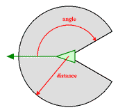

# Boids-Mini-Projet Group 1

## Intelligence distribuée

[définition](https://fr.wikipedia.org/wiki/Intelligence_distribuée) : Apparition de phénomènes cohérents à l'échelle d'une population dont les individus agissent selon des règles simples.

Indépendance entre les actions et règles qui régissent les individus et la forme ou la dynamique collective.

## Applications et Intérêts pour notre formation

Dans le cas présent des boids, on pourrait utiliser ce type d'algorithme embarqué sur un drone pour permettre à une flotte de drones de se dissimuler parmi des oiseaux ou des poissons.
Une autre application encore serait faire du mapping avec un poids de séparation réglée haut.
On peut simuler l'environnement aérien et sous-marin.

## Résumé concept Boids

On parle de boid dans un cas de figure comme celui où on a pas de communication.
Le voisinage est défini par une distance et un angle.

Permet de simuler un comportement égerment et évoluant en suivant ces 3 règles suivantes :

### Cohésion

Une entité d'un boid doit se diriger vers la position moyenne des voisins du boid.

### Alignement

L'entité doit se diriger dans la même direction que la direction moyenne de ses voisins de son boid.

### Séparation

L'entité ne doit pas non plus être trop proche sinon elle s'éloigne en gardant une "distance de sécurité".

## Description du projet

Qu'est ce qu'il se passe dans ce projet :

Un objet boidManager contenant le script boidSpawner,vient générer un prefab de boid le nombre de fois spécifié dans les réglages (boidSettings).
BoidUserInterface modifie directement les réglages de boidSettings.
Les scripts boid conaissent les boid settings.

## Liste des tâches

Toute l'équipe a travaillé d'arrache pied sur ce projet innovant et bien pensé.
Personne n'a été mis de côté. On a apprécié passer tous nos après-midi ensemble sur l'outil discord pour débattre de l'architecture et des noms de variables.

## Liste des scripts

- BoidSpawner
- Boid
- BoidSettings
- BoidUserInterface

## Listes de l'équipe 1

Group 1 branch

## Members:

- `amassonie` : Alexis Massonie
- `tdeporte` : Tom Deporte
- `nrodrigues64` : Nicolas Rodrigues
- `tyrarin` : Lucas Monlezun
- `R3B3-888` : Alexis Hoffmann

## Implémentation du comportement de ses entités

### Cohesion

### alignement

### séparation

### rencontre d'une autre entité

## Liste des "choses amusantes" à réaliser

- Gizmo
- UI
- amélioration de l'algorithmique sur les poids des différents facteurs.

Ce qu'on aimerait valoriser :

## Ressources

https://www.red3d.com/cwr/boids/
https://github.com/lormori/FlockingDemo/tree/f3f00d3619817fa2667381719f174739ae6bfd41
https://unity.com

